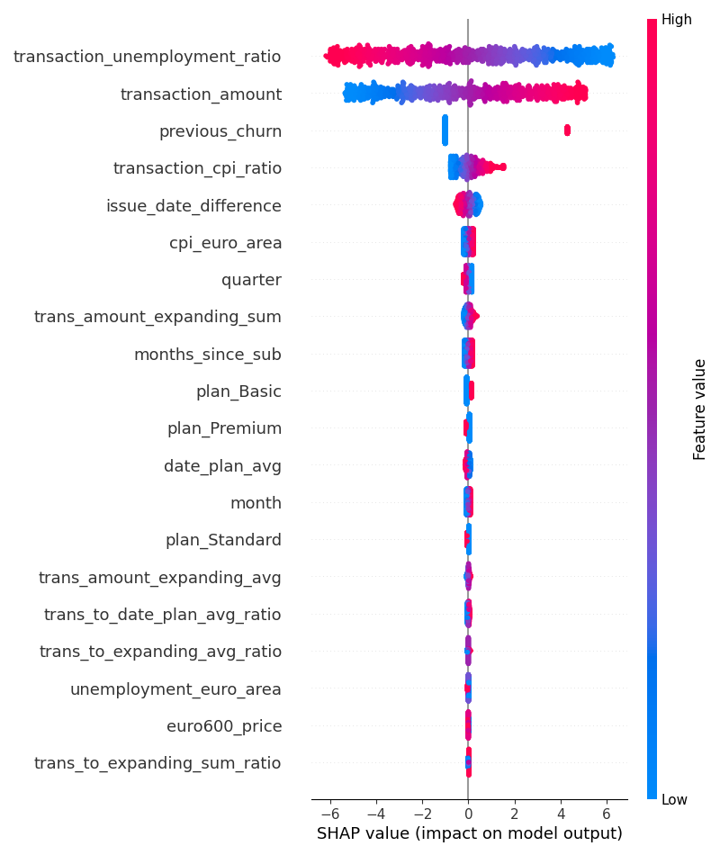

### Churn Prediction and Forecasting

    

This script preprocesses customer churn data, creates predictive features, and trains a logistic regression model to forecast customer churn. It handles missing values, generates features based on transaction history, customer plan type, and external economic indicators. Predictions are validated on the last two months (Nov-Dec 2023), and future churn predictions are generated for Jan-Feb 2024. Results, including predicted churn statuses, are exported to churn_data_preds.csv. Additionally, model performance metrics (precision, recall, accuracy, F1) are saved in model_metrics.json, and a SHAP summary plot explaining feature importance is saved as shap_summary_plot.png.

### What can be done better:
- better missing values filling process, see comments in the code
- generate more features, more external features
- try forecasting 1 step forward 2 times to use more data
- use different model type (LightGBM?) with feature preprocessing, scalers
- make hyperparameters tuning

A metric that I would try to maximize would be Recall, as I assume that company actions for possbile churns are not expansive, 
i.e. it's fine when some possible non-churners will be rewarded in return of not loosing customers.

### Evaluation
As seen from a SHAP plot, most impactful features are transaction_unemployment_ratio, transaction_amount, to some extent transaction_cpi_ratio, and issue_date_difference.

    

